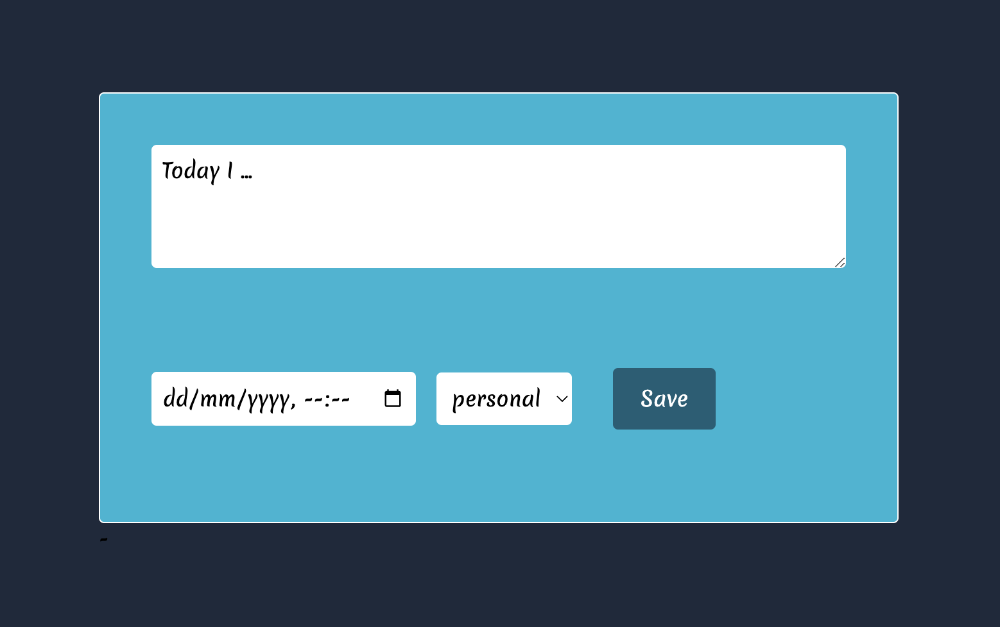

# Logger

**Super basic nextjs logger to save work/personal happenings to a google sheet.**

Replacement for IFTTT based thing that kept breaking.

## Features

- Full server-side security.
- Text input that creates a new row in a google sheet.
- Optional date input for adding historical entries - defaults to current date/time.
- Multiple categories: named tabs in the sheet are automatically put in a select-dropdown.

## Setup

- Needs a basic google sheet to be created.
- Generate google api env vars using [this](https://theoephraim.github.io/node-google-spreadsheet/#/guides/authentication) or [this](https://www.mridul.tech/blogs/save-form-data-in-google-sheets-with-next-js) tutorials.
- If you want to avoid public usage, set a `PASSKEY` env var and then append that as a query param to enable secret sections

- One-click deploy to Vercel with the below button:

